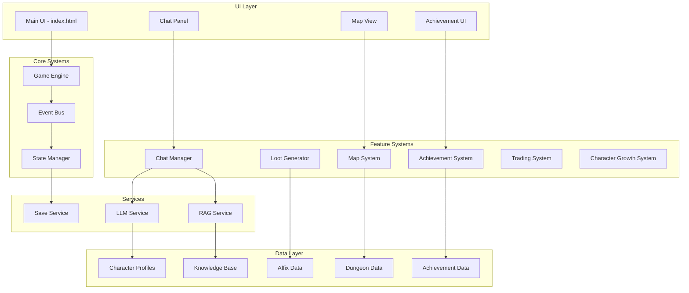
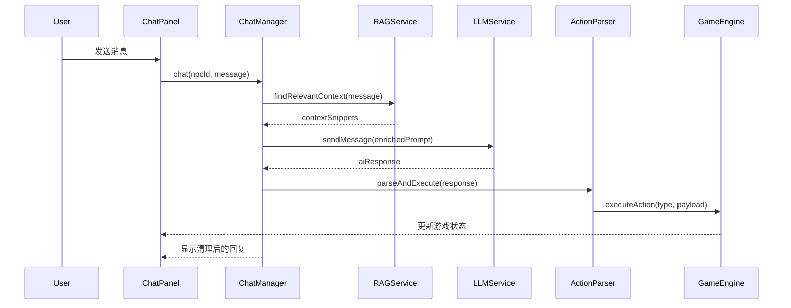

# Design Document: DungeonSpire Full Integration

## Overview

本设计文档描述了 DungeonSpire 全功能集成的技术架构和实现方案。目标是将已创建的后端系统（LLM 聊天、装备生成、成就系统等）完整集成到前端主页面，实现完整的 Roguelike 卡牌构筑游戏体验。

### 设计原则

1. **模块化**: 各系统独立封装，通过事件总线通信
2. **渐进增强**: 在现有战斗系统基础上逐步添加功能
3. **数据驱动**: 使用 JSON/JS 数据文件配置游戏内容
4. **优雅降级**: LLM 服务不可用时提供本地回退方案

## Architecture

### 系统架构图



### 数据流



## Components and Interfaces

### 1. ChatPanelComponent

聊天面板 UI 组件，负责显示对话和处理用户输入。

```javascript
class ChatPanelComponent {
    constructor(container, chatManager) {
        this.container = container;
        this.chatManager = chatManager;
        this.currentNpcId = null;
        this.isCollapsed = false;
    }
    
    // 渲染聊天面板
    render() {}
    
    // 切换 NPC
    selectNpc(npcId) {}
    
    // 发送消息
    async sendMessage(text) {}
    
    // 显示消息
    appendMessage(role, content, avatar) {}
    
    // 折叠/展开面板
    toggle() {}
    
    // 显示加载状态
    showTypingIndicator() {}
    hideTypingIndicator() {}
}
```

### 2. EnhancedChatManager

增强版聊天管理器，集成 RAG 和 Action 解析。

```javascript
class EnhancedChatManager {
    constructor(llmService, ragService, actionParser) {
        this.llmService = llmService;
        this.ragService = ragService;
        this.actionParser = actionParser;
        this.sessions = new Map();
    }
    
    // 初始化 NPC 聊天会话
    initNpc(npcId, profile) {}
    
    // 发送消息并获取回复
    async chat(npcId, userMessage) {}
    
    // 获取对话历史
    getHistory(npcId) {}
    
    // 清除会话
    clearSession(npcId) {}
}
```

### 3. EnhancedLootGenerator

增强版装备生成器，支持完整的词缀系统。

```javascript
class EnhancedLootGenerator {
    constructor() {
        this.prefixes = [];
        this.suffixes = [];
        this.baseItems = [];
    }
    
    // 加载词缀数据
    loadAffixes() {}
    
    // 生成装备
    generate(level, rarity, slot) {}
    
    // 应用词缀
    applyAffix(item, affix) {}
    
    // 计算最终属性
    calculateFinalStats(item, level) {}
    
    // 生成装备名称
    generateName(base, prefixes, suffixes) {}
}
```

### 4. RoguelikeMapSystem

Roguelike 地图系统，管理地图生成和节点导航。

```javascript
class RoguelikeMapSystem {
    constructor(eventBus) {
        this.eventBus = eventBus;
        this.currentMap = null;
        this.currentNode = null;
        this.visitedNodes = new Set();
    }
    
    // 生成新地图
    generateMap(act, floors) {}
    
    // 获取可访问节点
    getAccessibleNodes() {}
    
    // 移动到节点
    moveToNode(nodeId) {}
    
    // 完成当前节点
    completeCurrentNode() {}
    
    // 渲染地图
    renderMap(container) {}
}
```

### 5. AchievementManager

成就管理器，追踪和解锁成就。

```javascript
class AchievementManager {
    constructor(eventBus) {
        this.eventBus = eventBus;
        this.achievements = new Map();
        this.unlockedAchievements = new Set();
    }
    
    // 加载成就定义
    loadAchievements() {}
    
    // 检查成就条件
    checkAchievements(eventType, eventData) {}
    
    // 解锁成就
    unlock(achievementId) {}
    
    // 获取成就列表
    getAchievementsByCategory(category) {}
    
    // 显示解锁通知
    showUnlockNotification(achievement) {}
}
```

### 6. IntegratedUIManager

集成 UI 管理器，协调所有 UI 组件。

```javascript
class IntegratedUIManager {
    constructor(gameEngine) {
        this.gameEngine = gameEngine;
        this.chatPanel = null;
        this.mapView = null;
        this.achievementPanel = null;
    }
    
    // 初始化所有 UI 组件
    initializeUI() {}
    
    // 更新布局
    updateLayout(chatPanelVisible) {}
    
    // 显示奖励界面（含动态装备）
    showRewardScreen(rewards) {}
    
    // 显示成就通知
    showAchievementNotification(achievement) {}
}
```

## Data Models

### NPC Profile

```javascript
const NPCProfile = {
    id: 'string',           // 唯一标识符
    name: 'string',         // 显示名称
    avatar: 'string',       // 头像路径或 emoji
    visuals: {
        portrait: 'string', // 立绘路径
        chatAvatar: 'string' // 聊天头像
    },
    llmConfig: {
        baseUrl: 'string',  // API 端点
        apiKey: 'string',   // API 密钥
        model: 'string',    // 模型名称
        temperature: 'number' // 温度参数
    },
    systemPrompt: 'string', // 系统提示词
    knowledgeFiles: ['string'], // 关联知识文件
    reactions: {            // 预设反应
        greeting: ['string'],
        farewell: ['string'],
        angry: ['string']
    },
    relationship: {
        level: 'number',    // 好感度等级
        points: 'number',   // 当前点数
        thresholds: ['number'] // 升级阈值
    }
};
```

### Generated Item

```javascript
const GeneratedItem = {
    uid: 'string',          // 唯一实例 ID
    baseId: 'string',       // 底材 ID
    name: 'string',         // 完整名称（含词缀）
    rarity: 'string',       // Common/Uncommon/Rare/Legendary
    slot: 'string',         // 装备槽位
    stats: {
        atk: 'number',
        def: 'number',
        hp: 'number',
        speed: 'number'
    },
    affixes: [{
        id: 'string',
        type: 'string',     // Prefix/Suffix
        name: 'string',
        effect: 'string'
    }],
    value: 'number',        // 售价
    level: 'number'         // 物品等级
};
```

### Map Node

```javascript
const MapNode = {
    id: 'string',           // 节点 ID
    type: 'string',         // Enemy/Elite/Boss/Event/Rest/Shop/Treasure
    floor: 'number',        // 所在层数
    x: 'number',            // X 坐标
    y: 'number',            // Y 坐标
    connections: ['string'], // 连接的节点 ID
    visited: 'boolean',     // 是否已访问
    data: {                 // 节点特定数据
        enemyId: 'string',
        eventId: 'string',
        rewards: ['object']
    }
};
```

### Achievement

```javascript
const Achievement = {
    id: 'string',           // 成就 ID
    name: 'string',         // 成就名称
    description: 'string',  // 描述
    icon: 'string',         // 图标
    category: 'string',     // combat/exploration/social/collection/challenge
    condition: {
        type: 'string',     // 条件类型
        target: 'any',      // 目标值
        current: 'number'   // 当前进度
    },
    reward: {
        type: 'string',     // 奖励类型
        value: 'any'        // 奖励值
    },
    unlocked: 'boolean',    // 是否已解锁
    unlockedAt: 'Date'      // 解锁时间
};
```

### Game State (Extended)

```javascript
const ExtendedGameState = {
    // 现有状态
    char: 'string',
    hp: 'number',
    maxHp: 'number',
    gold: 'number',
    deck: ['string'],
    // ...
    
    // 新增状态
    currentMap: 'MapNode[]',
    currentNodeId: 'string',
    visitedNodes: ['string'],
    inventory: ['GeneratedItem'],
    equippedItems: {
        weapon: 'GeneratedItem',
        armor: 'GeneratedItem',
        accessory: 'GeneratedItem'
    },
    npcRelationships: {
        [npcId]: {
            level: 'number',
            points: 'number'
        }
    },
    unlockedAchievements: ['string'],
    chatHistories: {
        [npcId]: ['ChatMessage']
    },
    currentDungeon: 'string',
    mercenaries: ['Mercenary']
};
```


## Correctness Properties

*A property is a characteristic or behavior that should hold true across all valid executions of a system—essentially, a formal statement about what the system should do. Properties serve as the bridge between human-readable specifications and machine-verifiable correctness guarantees.*

### Property 1: Chat Session Initialization Preserves Configuration

*For any* NPC profile with valid LLM configuration, initializing a chat session SHALL create a session containing the NPC's system prompt and configuration parameters unchanged.

**Validates: Requirements 1.2**

### Property 2: Chat History Accumulation

*For any* sequence of messages sent to a chat session, the conversation history SHALL contain all messages in order, with each message having the correct role (user/assistant/system).

**Validates: Requirements 1.7**

### Property 3: Action Marker Parsing and Execution

*For any* AI response containing action markers in the format `[ACTION_TYPE: payload]`, the Action_Parser SHALL extract all markers and execute the corresponding game actions with correct payloads.

**Validates: Requirements 1.5, 10.1**

### Property 4: RAG Context Relevance

*For any* user query and knowledge base, the RAG_Service SHALL return context snippets where each snippet contains at least one keyword from the query (case-insensitive).

**Validates: Requirements 2.2**

### Property 5: RAG Prompt Enrichment

*For any* system prompt and relevant context snippets, the enriched prompt SHALL contain both the original system prompt and all context snippets in a structured format.

**Validates: Requirements 2.3**

### Property 6: Character Knowledge Prioritization

*For any* NPC with character-specific knowledge files, when searching for context, results from character-specific files SHALL rank higher than general knowledge files with equal keyword matches.

**Validates: Requirements 2.4**

### Property 7: Affix Application Correctness

*For any* base item and affix (prefix or suffix), applying the affix SHALL:
- Modify the item name to include the affix name in the correct position (prefix before, suffix after)
- Apply all stat modifications defined in the affix

**Validates: Requirements 3.3, 3.4**

### Property 8: Rarity-Based Affix Count

*For any* equipment generation with a specified rarity, the number of applied affixes SHALL match the rarity tier:
- Common: 0 affixes
- Uncommon: 1 prefix
- Rare: 1 prefix + 1 suffix
- Legendary: 2 prefixes + 1 suffix

**Validates: Requirements 3.2**

### Property 9: Level Scaling Monotonicity

*For any* two floor levels L1 < L2, equipment generated at L2 SHALL have stats greater than or equal to equivalent equipment generated at L1.

**Validates: Requirements 3.5**

### Property 10: Map Connectivity

*For any* generated map, there SHALL exist at least one path from the starting node to the boss node, and all nodes on this path SHALL be reachable through sequential node completion.

**Validates: Requirements 4.1, 4.4**

### Property 11: Node Type Distribution

*For any* generated map, the map SHALL contain at least one node of each required type: Enemy, Elite, Boss, Event, Rest, Shop.

**Validates: Requirements 4.2**

### Property 12: Node Completion State Transition

*For any* node that is completed, the node SHALL be marked as visited, and all directly connected nodes SHALL become accessible (if not already visited).

**Validates: Requirements 4.4**

### Property 13: Achievement Condition Checking

*For any* game event and achievement with a matching condition type, the Achievement_System SHALL evaluate the condition and unlock the achievement if the condition is satisfied.

**Validates: Requirements 5.2**

### Property 14: Relationship Point Accumulation

*For any* sequence of NPC interactions, the relationship points SHALL accumulate correctly, and the relationship level SHALL increase when points exceed the threshold for the current level.

**Validates: Requirements 6.1, 6.2**

### Property 15: Gift Preference Effect

*For any* gift given to an NPC, the relationship point change SHALL be positive if the gift matches NPC preferences, and the magnitude SHALL reflect the preference strength.

**Validates: Requirements 6.3**

### Property 16: Dungeon Area Enemy Restriction

*For any* combat encounter in a specific dungeon area, all spawned enemies SHALL be from the enemy list defined for that area.

**Validates: Requirements 7.3**

### Property 17: Area Boss Correctness

*For any* dungeon area, reaching the final floor SHALL spawn the boss defined in that area's configuration.

**Validates: Requirements 7.4**

### Property 18: Transaction Integrity

*For any* purchase or sale transaction:
- Purchase: player gold SHALL decrease by item price, and item SHALL be added to inventory
- Sale: player gold SHALL increase by item value (with depreciation), and item SHALL be removed from inventory

**Validates: Requirements 8.2, 8.3**

### Property 19: Shop Item Display Completeness

*For any* item displayed in the shop, the display SHALL include: item name, all stats, price, and visual indication of affordability (based on current gold).

**Validates: Requirements 8.4**

### Property 20: Mercenary HP Independence

*For any* combat with a hired mercenary, damage dealt to the mercenary SHALL only affect the mercenary's HP, not the player's HP, and vice versa.

**Validates: Requirements 9.3**

### Property 21: Trigger System Keyword Detection

*For any* registered keyword-action pair and AI response containing that keyword, the Trigger_System SHALL execute the registered action.

**Validates: Requirements 10.2**

### Property 22: Save/Load Round-Trip

*For any* valid game state, saving and then loading SHALL produce a game state equivalent to the original (all fields match).

**Validates: Requirements 12.1, 12.2**

## Error Handling

### LLM Service Errors

| Error Type | Handling Strategy |
|------------|-------------------|
| Network timeout | Retry up to 3 times with exponential backoff, then show fallback message |
| API rate limit | Queue messages and retry after delay, show "thinking..." indicator |
| Invalid API key | Log error, disable LLM features, use MockLLMService |
| Malformed response | Parse what's possible, log warning, return partial response |

### Data Loading Errors

| Error Type | Handling Strategy |
|------------|-------------------|
| Missing data file | Log warning, use default values, continue initialization |
| Invalid JSON | Log error with file path, skip file, continue with other files |
| Missing required field | Use default value, log warning |

### Game State Errors

| Error Type | Handling Strategy |
|------------|-------------------|
| Corrupted save | Offer to start new game, backup corrupted save for debugging |
| Invalid state transition | Log error, revert to last valid state |
| Missing referenced entity | Create placeholder, log warning |

### Fallback Strategies

```javascript
const FallbackStrategies = {
    llmUnavailable: {
        // 使用 MockLLMService 提供预设回复
        useService: 'MockLLMService',
        // 从 reactions 和 starters 中选择回复
        selectFromPresets: true
    },
    
    ragUnavailable: {
        // 不注入额外上下文，使用基础 system prompt
        skipContextEnrichment: true
    },
    
    saveCorrupted: {
        // 提供新游戏选项
        offerNewGame: true,
        // 备份损坏的存档
        backupCorrupted: true
    }
};
```

## Testing Strategy

### Unit Tests

单元测试覆盖各个组件的核心功能：

1. **ChatManager Tests**
   - Session initialization with various NPC profiles
   - Message sending and history management
   - Error handling for API failures

2. **LootGenerator Tests**
   - Base item selection
   - Affix application (prefix/suffix)
   - Level scaling calculations
   - Rarity-based affix counts

3. **MapSystem Tests**
   - Map generation with correct structure
   - Node accessibility calculations
   - Path finding to boss

4. **AchievementManager Tests**
   - Achievement loading
   - Condition evaluation
   - Unlock state management

5. **ActionParser Tests**
   - Marker extraction from various response formats
   - Action execution for each action type
   - Handling of malformed markers

### Property-Based Tests

使用 fast-check 库进行属性测试，每个测试运行至少 100 次迭代：

```javascript
// 测试框架配置
const propertyTestConfig = {
    numRuns: 100,
    seed: Date.now(),
    verbose: true
};
```

**Property Test Tags Format**: `Feature: dungeon-spire-full-integration, Property N: [Property Title]`

1. **Property 3 Test**: Action Marker Parsing
   - Generate random strings with embedded action markers
   - Verify all markers are extracted and parsed correctly

2. **Property 7 Test**: Affix Application
   - Generate random base items and affixes
   - Verify name and stat modifications are correct

3. **Property 8 Test**: Rarity-Based Affix Count
   - Generate equipment at each rarity tier
   - Verify affix counts match specification

4. **Property 10 Test**: Map Connectivity
   - Generate random maps
   - Verify path exists from start to boss

5. **Property 18 Test**: Transaction Integrity
   - Generate random buy/sell transactions
   - Verify gold and inventory changes are correct

6. **Property 22 Test**: Save/Load Round-Trip
   - Generate random game states
   - Save, load, and compare for equality

### Integration Tests

1. **Chat Flow Integration**
   - Full flow from user input to displayed response
   - RAG context injection verification
   - Action execution from AI responses

2. **Combat Reward Integration**
   - Victory triggers loot generation
   - Generated items display correctly
   - Items can be equipped and affect stats

3. **Map Navigation Integration**
   - Map generation and display
   - Node selection and encounter triggering
   - Progress persistence across sessions

### Test Data Generators

```javascript
// 用于属性测试的数据生成器
const Generators = {
    npcProfile: fc.record({
        id: fc.string(),
        name: fc.string(),
        systemPrompt: fc.string(),
        llmConfig: fc.record({
            baseUrl: fc.constant('https://api.example.com'),
            model: fc.string(),
            temperature: fc.float({ min: 0, max: 2 })
        })
    }),
    
    baseItem: fc.record({
        id: fc.string(),
        name: fc.string(),
        slot: fc.constantFrom('Weapon', 'Armor', 'Accessory'),
        stats: fc.record({
            atk: fc.integer({ min: 0, max: 100 }),
            def: fc.integer({ min: 0, max: 100 }),
            hp: fc.integer({ min: 0, max: 500 })
        }),
        value: fc.integer({ min: 1, max: 1000 })
    }),
    
    affix: fc.record({
        id: fc.string(),
        name: fc.string(),
        type: fc.constantFrom('Prefix', 'Suffix'),
        statModifiers: fc.dictionary(
            fc.constantFrom('atk', 'def', 'hp'),
            fc.integer({ min: -50, max: 50 })
        )
    }),
    
    gameState: fc.record({
        hp: fc.integer({ min: 1, max: 100 }),
        maxHp: fc.integer({ min: 1, max: 100 }),
        gold: fc.integer({ min: 0, max: 10000 }),
        floor: fc.integer({ min: 1, max: 50 }),
        deck: fc.array(fc.string(), { minLength: 5, maxLength: 30 })
    })
};
```
